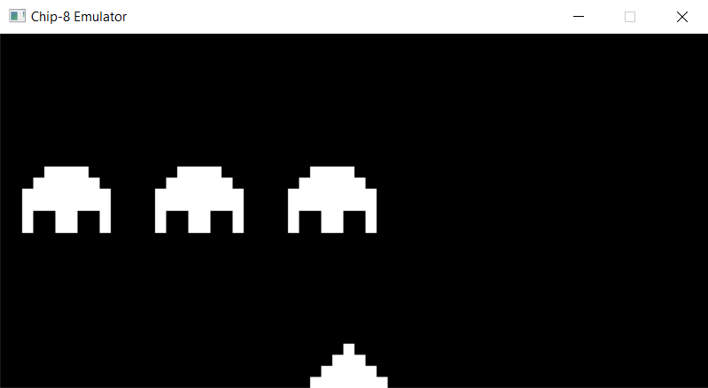
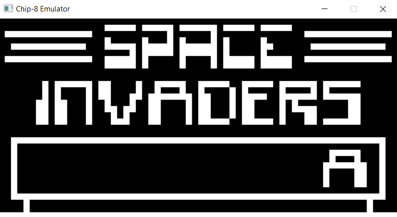
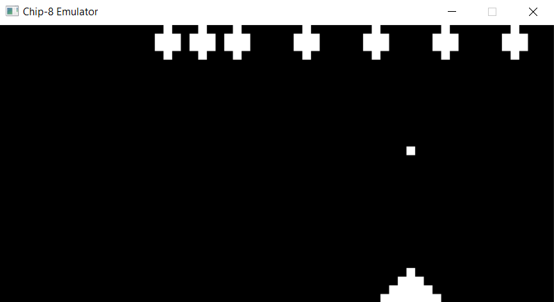

# Chip-8-emulator
Chip-8 was a simple interpreted language that was fairly popular in the mid 1970s. It was supposed to run on a chip-8 virtual machine that would interpret the commands on the host machines (COSMAC VIP and Telmac 1800 8-bit). This project is a simple emulator that emulates the functionality and aims to recreate the functionality that the old virtual machines provided.

# Sample ROMs
### Space Invaders:  ###

- - - -

- - - -
### Missile: ###

# Usage
Simply go to the LoadProgram function call and change the file path to whatever ROM you would like to play. Can be in bin or ch8 format. Some games differ in their optimal clockspeed so you might have to tweak that manually

# References
For anyone interested in replicating this emulator I'd heavily suggest the following references That were of much help to me:

https://en.wikipedia.org/wiki/CHIP-8  
http://devernay.free.fr/hacks/chip8/C8TECH10.HTM
